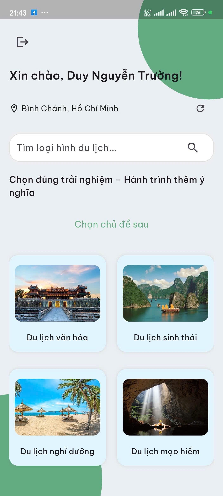
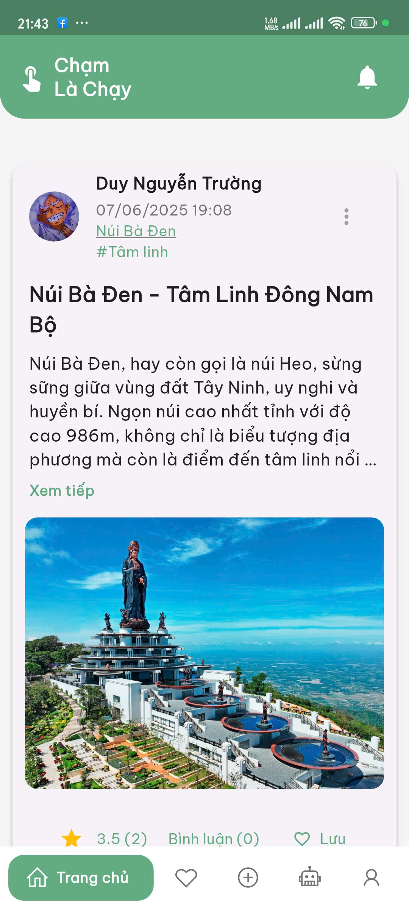
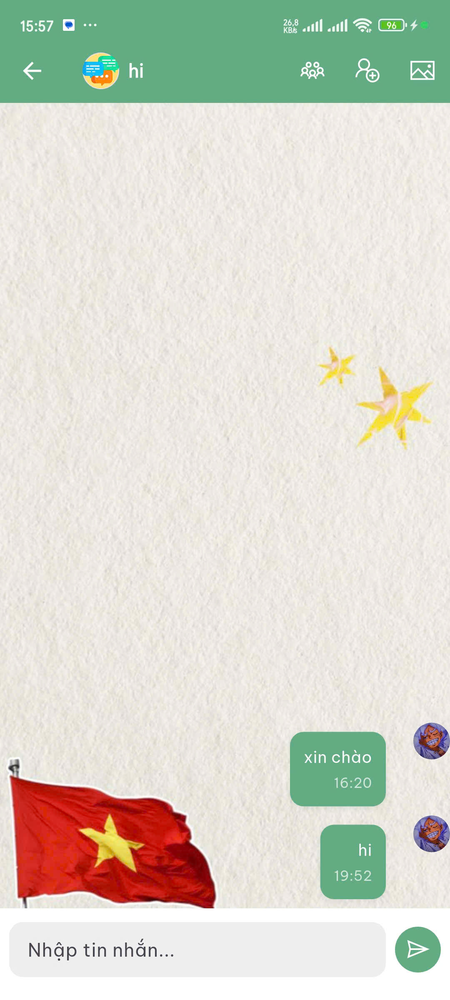

# 🌍 Travel Social Network App 📱

> A platform connecting travel enthusiasts to share destinations and travel experiences!

---

## ✨ Overview

**Travel Social Network App** is designed to create a space where users can:
- 📸 Share photos and reviews of travel destinations  
- 🗺️ Explore popular places through community posts  
- 🧭 Rate and comment on locations  
- 👥 Connect and follow fellow travel lovers  

---

## 💡 Key Features

- ✅ User registration and login  
- 🖼️ Post creation with photos and geolocation  
- 💬 Commenting, liking, and rating posts  
- 🔍 Search for places and users  
- 📍 Map integration for travel destinations  
- 💬 Real-time chat and AI chatbot support  

---

## 🛠️ Technologies Used

| Component             | Technology                   |
|------------------------|------------------------------|
| ⚙️ Backend             | Firebase                     |
| 📱 Mobile App         | Flutter                      |
| ☁️ Database           | Firebase Firestore           |
| 🖼️ Media Storage      | Firebase Storage             |
| 🗺️ Maps & Geolocation | Google Maps API             |
| 🤖 AI Chatbot         | Gemini 1.5 (via Flask API)   |

---

## 📷 UI Previews

| Home Page | Post View | Chat Screen |
|-----------|-----------|-------------|
|  |  |  |

---

## 👩‍💻 Team Members

- **Nguyễn Trường Duy** – Team leader, developed real-time chat, chatbot, push notifications, designed UI in Figma, and handled UI refinements.  
- **Nguyễn Viết Tiến** – Business analysis, functional decomposition diagrams, post creation features, Figma design, and system architecture.  
- **Nguyễn Minh Khang** – Designed user profile interfaces, post saving & memory features, and Figma design.  
- **Nguyễn Hải Đăng** – Business analysis, system use-case diagrams, post creation functionality, system architecture, and Figma design.  
- **Bùi Kim Hải** – Built user profile UI, category-based travel filtering, and Figma UI design.

---

## 🏆 Achievement

- Finalist in the Academic Research Competition of the Faculty of Information Technology.

---

## 📆 Future Development

- Smart travel recommendations  
- Dark Mode, font size and style customization  
- Social login (Facebook, Twitter, etc.)  
- Support for videos and multiple images in posts & chats  
- Integration with weather API and advanced chatbot capabilities  

---

## 🚀 Getting Started

> **Note:** For security reasons, all API keys have been removed. To run the project, you must reconfigure Firebase, Google Maps API, Firebase Cloud Messaging, Gemini API, and OpenAI.

```bash
git clone https://github.com/TrDyy/MangXaHoiDuLich
cd MangXaHoiDuLich
flutter pub get
flutter run
